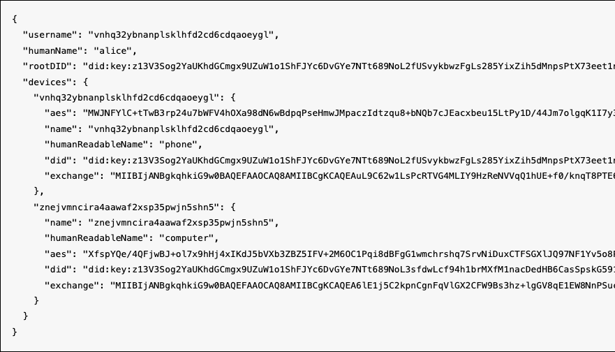

# link
[](README.md)
[](README.md)
[](https://semver.org/)
[](LICENSE)

Link multiple devices via websocket. Linking means that both devices share the
same AES key.

This depends on each device having a [keystore](https://github.com/fission-codes/keystore-idb) that stores the private keys. Also, you need a websocket server,
for example [partykit](https://www.partykit.io/).

We have two devices, a parent and a child. To securely send an AES key to
another device, the parent first opens a websocket connection at a random URL.
The URL for the websocket needs to be transmitted out-of-band.

When the new device (the child) connects to the websocket, it tells the parent
its public key. The parent then encrypts its AES key to the child's public key.
The child gets the key, which it is able to decrypt with its private key.

## install

```sh
npm i -S @bicycle-codes/link
```

## use

## example
Connect two devices, a phone and computer, for example. They must both know `code`, which by default is a 6 digit numberic code. The code must be transmitted out of band.

```js
import { program as Program } from '@oddjs/odd'
import { create as createID } from '@bicycle-codes/identity'

const program = await Program({
    namespace: {
        name: 'link-example',
        creator: 'bicycle-computing'
    }
})
const { crypto } = program.components

const myId = await createID(crypto, {
    humanName: 'alice',
    humanReadableDeviceName: 'phone'
})

/**
 * 'phone' is the parent device. The parent should connect first.
 * The resolved promise is for a new `Identity`, which is a new ID, including
 * the child device
 */
const newIdentity = await Parent(myId, crypto, {
    host: 'localhost:1999',
    code: '1234'
})
```

...On a different machine...

```js
const program = await Program({
    namespace: {
        name: 'link-example',
        creator: 'bicycle-computing'
    }
})
const { crypto } = program.components

const { identity, certificate } = await Child(crypto, {
    host: PARTY_URL,
    code: '1234',
    humanReadableDeviceName: 'computer'
})
```

Both machines now have an ID that looks like this:



### serverside
This depends on a websocket server existing. We provide the export
`server` to help with this.

This should be ergonomic to use with [partykit](https://www.partykit.io/).

#### server example

```js
import type * as Party from 'partykit/server'
import { onConnect, onMessage } from '@bicycle-codes/link/server'

export default class Server implements Party.Server {
    existingDevice:string|undefined

    constructor (readonly room: Party.Room) {
        this.room = room
    }

    /**
     * Parent device must connect first
     */
    onConnect (conn:Party.Connection) {
        onConnect(this, conn)
    }

    onMessage (message:string, sender:Party.Connection) {
        onMessage(this, message, sender)
    }
}

Server satisfies Party.Worker
```

## API

### Parent
Call this from the "parent" device. It returns a promise that will resolve with a new identity, that includes the child devices.

```ts
import type { Crypto, Identity } from '@bicycle-codes/identity'

async function Parent (identity:Identity, oddCrypto:Crypto, {
    host,
    code,
    query
}:{
    host:string;
    code:string;
    query?:string;
}):Promise<Identity>
```

### Child
Call this from the "child" device. It returns a promise that will resolve with
`{ identity, certificate }`, where `certificate` is a signed message from the
parent device, serving as proof that the child is authorized.

```ts
import type { Crypto, Identity } from '@bicycle-codes/identity'

async function Child (oddCrypto:Crypto, {
    host,
    code,
    query,
    humanReadableDeviceName
}:{
    host:string;
    code:string;
    query?:string;
    humanReadableDeviceName:string;
}):Promise<{ identity:Identity, certificate:Certificate }>
```

### Code
Need to create a code before connecting the parent device. The code should be transmitted out-of-band; it serves as verification that the two devices want to connect.

By default this will create a random 6 digit numeric code; see the source code
for how to use a different alphabet.

```ts
function Code (alphabet?:string, length?:number):string {
    return customAlphabet(alphabet || numbers, length ?? 6)()
}
```

#### `Code` example
```js
import { Code } from '@bicycle-codes/link'
const code = Code()
// => 942814
```

## types

### Certificate

The certificate is a signed message from the "parent" device,
saying that the new device is authorized.
 
```ts
import { create as createMessage } from '@bicycle-codes/message'

type Certificate = Awaited<
    ReturnType<typeof createMessage<{
        exp?:number;  /* <-- Expiration, unix timestamp,
            after which this certificate is no longer valid.
            Default is no expiration. */
        nbf?:number  /* <-- Not Before, unix timestamp of when the certificate
            becomes valid. */
        recipient:DID  // <-- DID of who this certificate is intended for
    }>>
>
```

The certificate will also have keys `author` and `signature`, via the
[message module](https://github.com/bicycle-codes/message), with the DID and
signature for this data.
